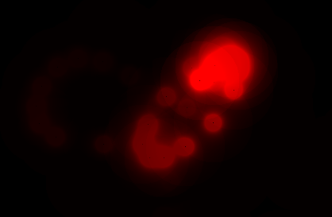

Some of my web experiments. Check [my blog](https://oktomus.com) where I talk about rendering and shaders.

🚧 Disclaimer: Most of these are made using draft APIs.

### WebGL 2.0 Compute: toy ray tracer

- blogpost [Writing a ray tracer for the web](https://oktomus.com/posts/2020/ray-tracer-with-webgl-compute/)
- [code](https://github.com/oktomus/web-experiments/tree/master/webgl-compute/toy-raytracer)
- [demo](https://oktomus.com/web-experiments/webgl-compute/toy-raytracer/)

While this ray tracer is not physically correct and boring, it's a good example of what you can acheive with compute shaders in web.

This was made possible thanks to WebGL 2.0 Compute, an experimental feature currently available on Google Chrome (Linux or Windows).

Many thanks to 9ballsyndrome for his help and especially for his repository WebGL_Compute_shader where you can find really cool stuff made using WebGL 2.0 Compute.

## WebGL 2.0 Compute: Random number generator

- [code](https://github.com/oktomus/web-experiments/tree/master/webgl-compute/toy-raytracer)
- [demo](https://oktomus.com/web-experiments/webgl-compute/toy-raytracer/)

How to generate random numbers in a compute shader.

## WebGL 2.0 Compute: Framebuffer accumulation

- [code](https://github.com/oktomus/web-experiments/tree/master/webgl-compute/progressive-steps)
- [demo](https://oktomus.com/web-experiments/webgl-compute/progressive-steps/)

Keep a buffer over time and add values onto it. Useful in raytracing to do progressive rendering.

## WebGPU API: Getting started

| What  |  Code link  |  Web demo link  | 
|---|---|---|
| Access the GPU  | [code](https://github.com/oktomus/web-experiments/tree/master/webgpu/basics-00-init)  | [demo](https://oktomus.com/web-experiments/webgpu/basics-00-init/) |
| Create a buffer | [code](https://github.com/oktomus/web-experiments/tree/master/webgpu/basics-01-create-buffer) | [demo](https://oktomus.com/web-experiments/webgpu/basics-01-create-buffer/) |
| Create a buffer and copy it to the GPU | [code](https://github.com/oktomus/web-experiments/tree/master/webgpu/basics-02-create-send-buffer) | [demo](https://oktomus.com/web-experiments/webgpu/basics-02-create-send-buffer/) |
| Compile and run a compute shader | [code](https://github.com/oktomus/web-experiments/tree/master/webgpu/basics-03-run-compute-shader) | [demo](https://oktomus.com/web-experiments/webgpu/basics-03-run-compute-shader/) |
| Matrix multiplication with compute shader | [code](https://github.com/oktomus/web-experiments/tree/master/webgpu/basics-04-compute-shader-multiply-matrices) | [demo](https://oktomus.com/web-experiments/webgpu/basics-04-compute-shader-multiply-matrices/) |
| Draw a triangle with vertex + fragment shader | [code](https://github.com/oktomus/web-experiments/tree/master/webgpu/basics-05-draw-one-triangle) |  [demo](https://oktomus.com/web-experiments/webgpu/basics-05-draw-one-triangle/) |
| Draw using a vertex buffer | [code](https://github.com/oktomus/web-experiments/tree/master/webgpu/basics-06-draw-vertex-buffer) | [demo](https://oktomus.com/web-experiments/webgpu/basics-06-draw-vertex-buffer/) |
| Draw using a index buffer | [code](https://github.com/oktomus/web-experiments/tree/master/webgpu/basics-07-draw-vertex-and-index-buffer) | [demo](https://oktomus.com/web-experiments/webgpu/basics-07-draw-vertex-and-index-buffer/) |
| Use uniforms in fragment shader | [code](https://github.com/oktomus/web-experiments/tree/master/webgpu/basics-08-uniforms) | [demo](https://oktomus.com/web-experiments/webgpu/basics-08-uniforms) |
| Load and sample a texture | [code](https://github.com/oktomus/web-experiments/tree/master/webgpu/basics-09-sample-texture) | [demo](https://oktomus.com/web-experiments/webgpu/basics-09-sample-texture) |

## Threejs : facing ratio shader

- [code](https://github.com/oktomus/web-experiments/tree/master/threejs/facing-ratio) 
- [demo](https://oktomus.com/web-experiments/threejs/facing-ratio/)

Really basic shader setup with threejs.
